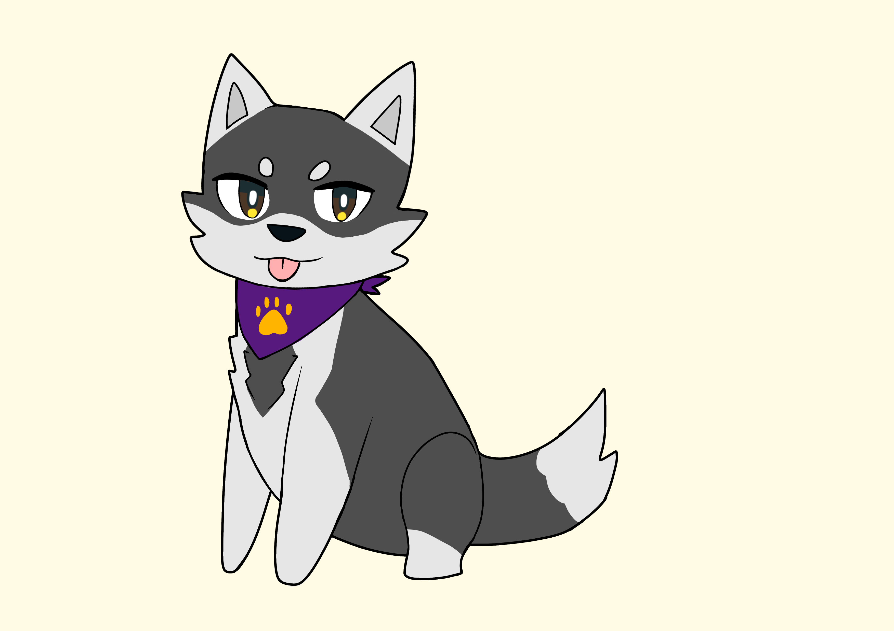
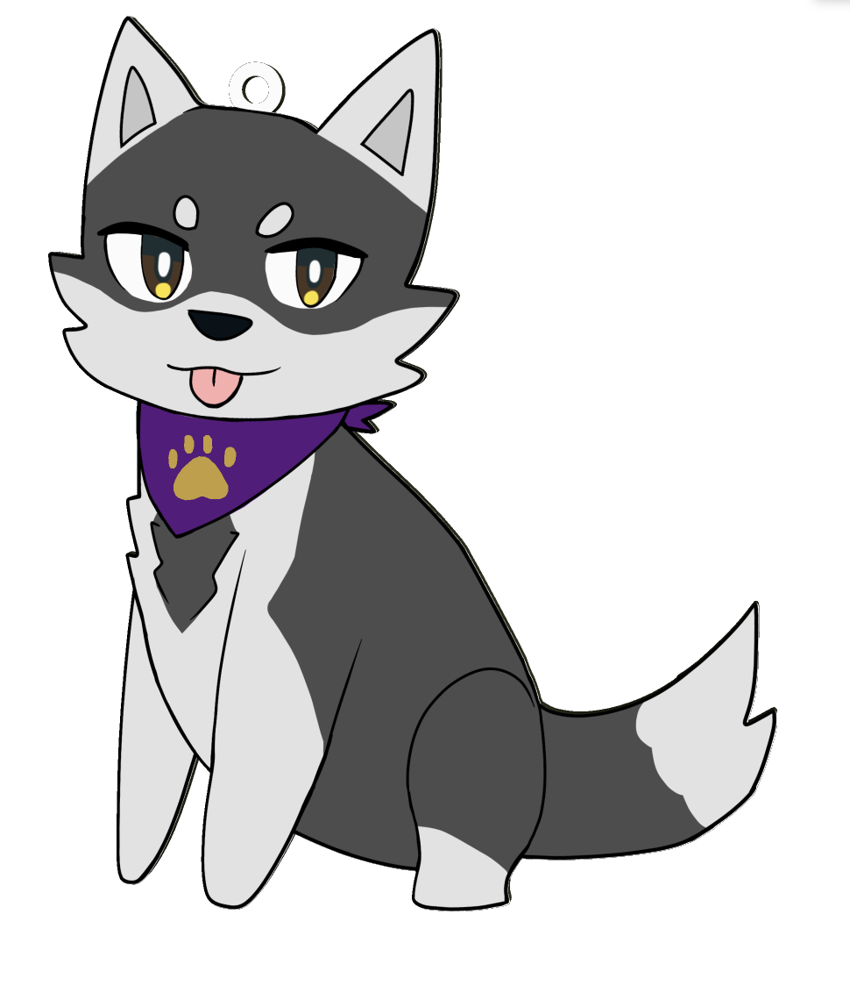
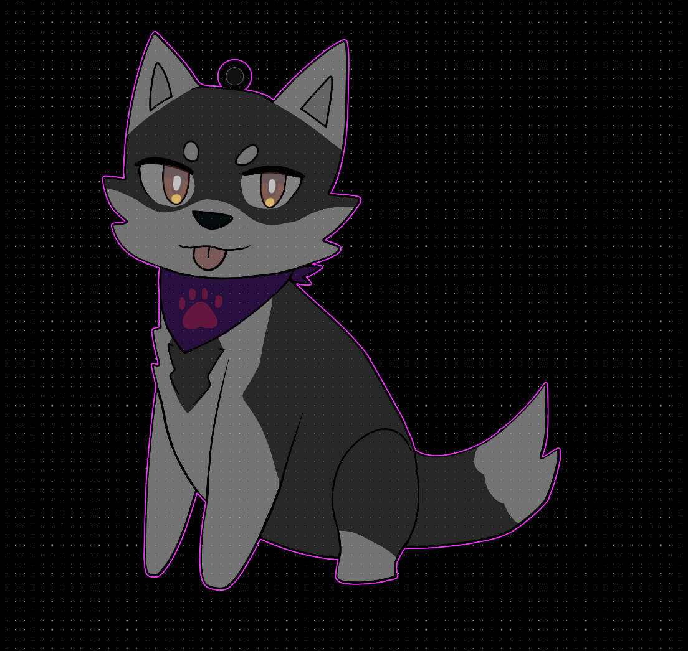

# PCB-Keychain-design

## Description
This project is my own hand drawn art made on Procreate. I decided to draw a husky since I love drawing animals especially dogs. The embossed part is the eyes and the gold layer is the little paw.

## Why I started this project
I was inspired by the stickers I got in general and I saw how great they were drawn to the composition. I first referenced a sticker I got from the local university and then decided to copy it on my first try. Although I forget to record so I had to restart in order for my hours to count! It's okay it was a learning experience anyways.

The hardest part was the alignment. I set my canvas size to A4 so I guess that made it harder. It doesn't have to be perfect so I left my project that way with a little but of white lines. So no worries and it basically looks like highlights anyways.

## Demo
Link to Demo: [Demo](https://pro.easyeda.com/editor#id=d63a31b47be740fd97740a7a62f5ce04,tab=*40a65902f232478abc52a5ea222fa3cd@d63a31b47be740fd97740a7a62f5ce04)

## Artwork

## PCB Render Image

## PCB Editor Preview

### Estimated Time: ~4 hours